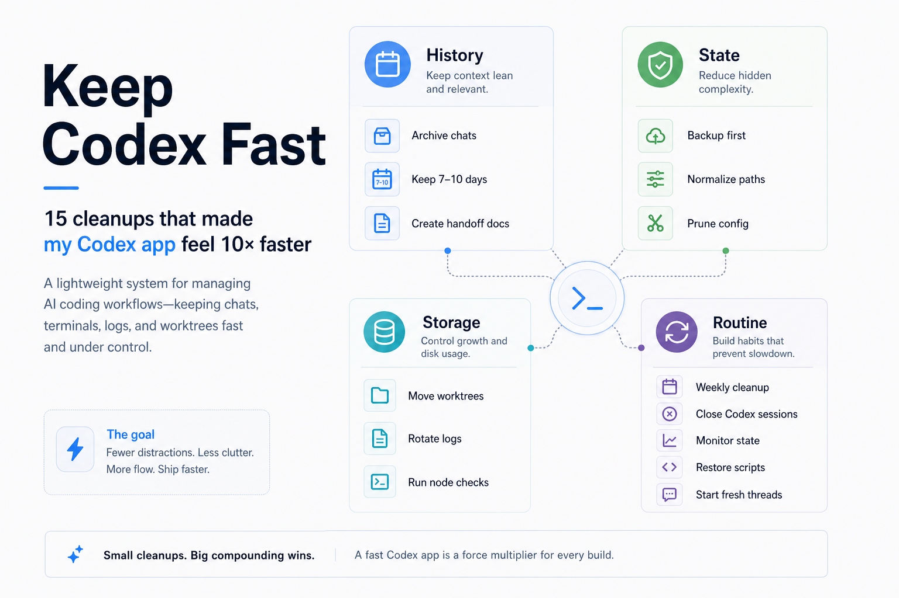
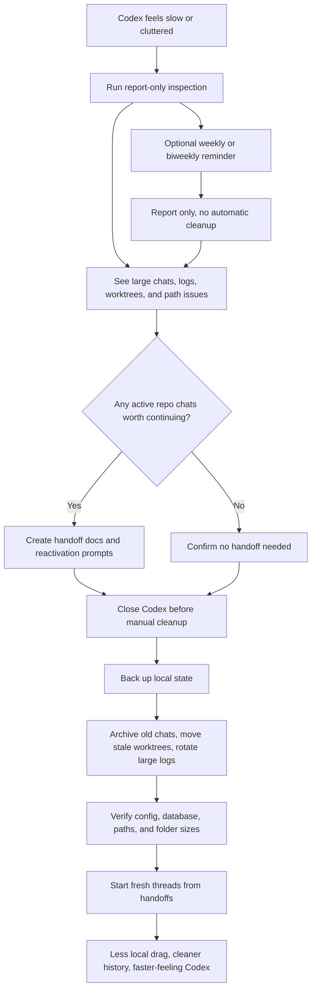

# Keep Codex Fast



Keep Codex fast when your local workspace starts getting heavy from weeks of chats, terminals, logs, worktrees, and project history.

This skill helps you clean things up without losing context.

It is built around one simple rule:

> Make handoffs first. Archive, don't delete. Clean up only when you are ready.

The basic flow:

- inspect first
- make handoffs for work you still care about
- back up important local state
- archive heavy old history instead of deleting it
- verify Codex feels lighter afterward

## Who This Is For

Use this if Codex has started feeling slower after heavy use, especially if you:

- keep lots of long chats
- resume old threads often
- work across many repos
- run multiple terminals or dev servers
- want a weekly cleanup habit that does not feel risky

## What It Does

The skill helps Codex:

- inspect what is making local state heavy
- create handoff docs before old chats are archived
- back up important state before cleanup
- archive old chats instead of deleting them
- move stale worktrees out of the hot path
- rotate large logs
- clean up dead project references
- report heavy Node/dev processes without killing them

By default, it only reports. It does not mutate anything unless you explicitly ask it to.

## Quick Start

Ask Codex:

```text
Use $keep-codex-fast to inspect my Codex local state and recommend a safe cleanup plan.
```

Codex should first show you what it found, then help you decide what to hand off, what to keep active, and what can be archived.

## Before Cleanup: Make Handoffs

Before archiving old active chats, create handoff documents for any repo/session you may want to continue.

A handoff document is a small continuity file. It captures what you were doing, what changed, what files matter, what commands ran, what is broken, and what to do next.

This lets you archive the heavy chat history and start a fresh Codex thread without losing the thread of the work.

Recommended habit: create handoffs for all active repo chats you may continue, even before you feel slowdown. It keeps chats for execution and docs for memory.

In plain English, a handoff helps you:

- keep the project memory
- drop the heavy chat baggage
- restart from a clean thread
- give Codex the exact next steps
- avoid re-explaining where you left off

Copy-paste this into each active repo chat you care about:

```text
Create a comprehensive handoff document for this repo/session before I archive or clean up Codex history.

Include:
- repo/path and branch
- current goal
- what we already completed
- files touched or investigated
- commands/tests already run
- known errors, warnings, or failing checks
- open decisions
- constraints, user preferences, and do-not-touch areas
- the next 3-7 concrete steps

Also include a reactivation prompt I can paste into a fresh Codex chat so it can continue from this handoff without relying on the old chat context.

Save the handoff in a sensible repo-local place like docs/codex-handoffs/YYYY-MM-DD-topic.md unless this repo already has a better handoff location.
```

Then start the fresh chat with the reactivation prompt from that handoff.

## Safe Cleanup Prompt

After handoffs exist for the chats you care about, use this:

```text
Use $keep-codex-fast to apply safe cleanup.

Before changing anything, confirm that important active repo chats have handoff docs or do not need them.

Then back up first, archive instead of deleting, move stale worktrees, rotate large logs, clean dead config references, and verify the result.

If Codex is currently running, do not mutate local state. Tell me to close Codex first.
```

## Optional: Make It A Weekly Or Biweekly Reminder

After you run the first cleanup safely, you can ask Codex to turn this into a recurring maintenance reminder.

Important: recurring maintenance should be report-only. It can inspect, summarize, and remind you to create handoffs, but it should not archive, move, prune, rotate, normalize, delete, or mutate local Codex state automatically.

Why: an automation cannot reliably know whether you created handoff docs for the active repo chats you still care about. Mutating cleanup should stay manual unless you are present to confirm handoffs exist or are not needed.

Weekly is best if you use Codex heavily across many repos and terminals. Biweekly is enough if your usage is lighter.

Use the reminder for:

- noticing when sessions are getting large again
- catching stale worktrees before they pile up
- seeing when logs are growing
- remembering to create handoffs before manual cleanup
- keeping maintenance boring instead of emergency-shaped

Copy-paste this into Codex:

```text
Use $keep-codex-fast to create a recurring Codex maintenance reminder.

Schedule it weekly if I use Codex heavily, or biweekly if that seems safer.

The reminder should:
- run the keep-codex-fast report first
- never pass --apply or run mutating cleanup automatically
- never archive, move, prune, rotate, normalize, delete, or mutate local Codex state
- remind me to create comprehensive handoff docs and reactivation prompts for active repo chats before any manual cleanup
- summarize active session size, archived session size, extended path candidates, old session candidates, worktree candidates, log size, and top Node/dev processes
- report heavy Node/dev processes without killing them
- tell me that manual cleanup should only happen after I confirm handoffs exist or are not needed and Codex is closed
```

If your Codex app supports automations, ask it to schedule this reminder directly. If not, keep the prompt saved and run it manually once a week or every other week.

## Install

Install it with Codex's skill installer by pointing it at the repo:

```text
Install the keep-codex-fast skill from https://github.com/vibeforge1111/keep-codex-fast
```

Or clone/copy this folder into your Codex skills directory as `keep-codex-fast`.

For chats you still care about:

```text
Use $keep-codex-fast to identify active repo chats I may want to continue, create comprehensive handoff docs and reactivation prompts for them, then archive only after continuity is preserved.
```

Then, after reviewing the report and closing Codex if needed:

```text
Use $keep-codex-fast to apply the cleanup with backups, archive old non-pinned sessions, move stale worktrees, rotate large logs, and verify the result.
```

## Advanced: Manual Script Use

Most users can stay inside Codex and use the prompts above. The script is here for people who want to run it directly.

From this repo:

```bash
python scripts/keep_codex_fast.py
```

Apply cleanup:

```bash
python scripts/keep_codex_fast.py --apply --archive-older-than-days 10 --worktree-older-than-days 7
```

Wait for Codex to exit before applying:

```bash
python scripts/keep_codex_fast.py --apply --wait-for-codex-exit
```

## What It Cleans

- old non-pinned active sessions
- stale worktrees
- large `logs_2.sqlite*` files
- dead/temp project entries in `config.toml`
- Windows `\\?\C:\...` extended path mismatches in local SQLite text fields

It does not permanently delete chats, logs, or worktrees. It moves them into archive folders under `~/.codex` and writes backup/restore artifacts under `~/Documents/Codex/codex-backups` when available.

## Recommended Flow

1. Run a report-only inspection.
2. Create handoff docs and reactivation prompts for active repo chats you may want to continue.
3. Review large active chats and decide what can be archived.
4. Close Codex before applying cleanup.
5. Apply archive-only cleanup.
6. Re-run inspection to verify the result.
7. Decide whether to make this a weekly or biweekly report-only reminder.

## The Mental Model

Use chats for execution.

Use handoff docs for memory.

Use archives for history.

Use fresh threads for speed.

That is the main pattern this skill is trying to make easy.

## What Goes In A Handoff?

For important repo work, the skill should help create a handoff doc before archiving the old chat. A good handoff includes:

- repo/path and branch
- current goal
- work already completed
- files touched or investigated
- commands/tests run
- known errors or warnings
- open decisions
- next concrete steps
- a reactivation prompt for starting fresh

## Why This Exists

Long-running AI coding workspaces accumulate local drag. The model may be fine, but local sessions, logs, worktrees, and stale project metadata can make the app feel slower and more fragile.

This skill turns cleanup into a boring weekly maintenance routine.

## How The Skill Helps


