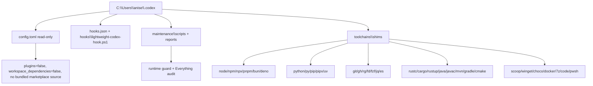

# Codex Development Environment Inventory

Generated: 2026-05-11 05:27:59 +09:00

## Executive Summary

- Active management root: `C:\Users\anise\.codex`
- Toolchain entrypoint root: `C:\Users\anise\.codex\toolchains\shims`
- Fresh User+Machine PATH starts with shim root: `True`
- Physical installer-owned binaries were not moved into `.codex`; `.codex` owns deterministic shims that call those canonical installs by absolute path.
- This avoids breaking package manager updates while making the active command surface visible and auditable under `.codex`.

## Current Command Resolution

| Command | First resolution | Uses .codex shim | Hits |
|---|---|---:|---:|
| `7z` | `C:\Users\anise\.codex\toolchains\shims\7z.cmd` | True | 2 |
| `bun` | `C:\Users\anise\.codex\toolchains\shims\bun.cmd` | True | 2 |
| `cargo` | `C:\Users\anise\.codex\toolchains\shims\cargo.cmd` | True | 2 |
| `choco` | `C:\Users\anise\.codex\toolchains\shims\choco.cmd` | True | 2 |
| `cmake` | `C:\Users\anise\.codex\toolchains\shims\cmake.cmd` | True | 2 |
| `code` | `C:\Users\anise\.codex\toolchains\shims\code.cmd` | True | 3 |
| `deno` | `C:\Users\anise\.codex\toolchains\shims\deno.cmd` | True | 2 |
| `docker` | `C:\Users\anise\.codex\toolchains\shims\docker.cmd` | True | 3 |
| `es` | `C:\Users\anise\.codex\toolchains\shims\es.cmd` | True | 2 |
| `fd` | `C:\Users\anise\.codex\toolchains\shims\fd.cmd` | True | 2 |
| `fzf` | `C:\Users\anise\.codex\toolchains\shims\fzf.cmd` | True | 2 |
| `gh` | `C:\Users\anise\.codex\toolchains\shims\gh.cmd` | True | 2 |
| `git` | `C:\Users\anise\.codex\toolchains\shims\git.cmd` | True | 2 |
| `gradle` | `C:\Users\anise\.codex\toolchains\shims\gradle.cmd` | True | 3 |
| `java` | `C:\Users\anise\.codex\toolchains\shims\java.cmd` | True | 2 |
| `javac` | `C:\Users\anise\.codex\toolchains\shims\javac.cmd` | True | 2 |
| `jq` | `C:\Users\anise\.codex\toolchains\shims\jq.cmd` | True | 2 |
| `mvn` | `C:\Users\anise\.codex\toolchains\shims\mvn.cmd` | True | 3 |
| `node` | `C:\Users\anise\.codex\toolchains\shims\node.cmd` | True | 2 |
| `npm` | `C:\Users\anise\.codex\toolchains\shims\npm.cmd` | True | 5 |
| `npx` | `C:\Users\anise\.codex\toolchains\shims\npx.cmd` | True | 5 |
| `pip` | `C:\Users\anise\.codex\toolchains\shims\pip.cmd` | True | 4 |
| `pipx` | `C:\Users\anise\.codex\toolchains\shims\pipx.cmd` | True | 2 |
| `pnpm` | `C:\Users\anise\.codex\toolchains\shims\pnpm.cmd` | True | 3 |
| `pwsh` | `C:\Users\anise\.codex\toolchains\shims\pwsh.cmd` | True | 2 |
| `py` | `C:\Users\anise\.codex\toolchains\shims\py.cmd` | True | 3 |
| `python` | `C:\Users\anise\.codex\toolchains\shims\python.cmd` | True | 4 |
| `rg` | `C:\Users\anise\.codex\toolchains\shims\rg.cmd` | True | 2 |
| `rustc` | `C:\Users\anise\.codex\toolchains\shims\rustc.cmd` | True | 2 |
| `rustup` | `C:\Users\anise\.codex\toolchains\shims\rustup.cmd` | True | 2 |
| `scoop` | `C:\Users\anise\.codex\toolchains\shims\scoop.cmd` | True | 3 |
| `uv` | `C:\Users\anise\.codex\toolchains\shims\uv.cmd` | True | 2 |
| `winget` | `C:\Users\anise\.codex\toolchains\shims\winget.cmd` | True | 2 |

## Version Check

| Tool | Version line |
|---|---|
| `node` | `v26.1.0` |
| `npm` | `11.14.0` |
| `npx` | `11.14.0` |
| `pnpm` | `11.0.8` |
| `bun` | `1.3.13` |
| `deno` | `deno 2.7.13 (stable, release, x86_64-pc-windows-msvc)` |
| `python` | `Python 3.14.4` |
| `pip` | `pip 26.0.1 from C:\Python314\Lib\site-packages\pip (python 3.14)` |
| `pipx` | `1.11.1` |
| `uv` | `uv 0.11.11 (ed7b06001 2026-05-06 x86_64-pc-windows-msvc)` |
| `git` | `git version 2.54.0.windows.1` |
| `gh` | `gh version 2.92.0 (2026-04-28)` |
| `rg` | `ripgrep 15.1.0 (rev af60c2de9d)` |
| `fd` | `fd 10.4.2` |
| `jq` | `jq-1.8.1` |
| `rustc` | `rustc 1.95.0 (59807616e 2026-04-14)` |
| `cargo` | `cargo 1.95.0 (f2d3ce0bd 2026-03-21)` |
| `java` | `openjdk 21.0.10 2026-01-20 LTS` |
| `mvn` | `Apache Maven 3.9.15 (98b2cdbfdb5f1ac8781f537ea9acccaed7922349)` |
| `gradle` | `` |
| `docker` | `Docker version 29.4.0, build 9d7ad9f` |

## Workflow And Runtime Config

```text
2:model = "gpt-5.5"
3:model_reasoning_effort = "xhigh"
4:personality = "pragmatic"
6:[features]
7:plugins = false
8:codex_hooks = true
9:multi_agent = true
10:goals = true
11:child_agents_md = true
12:memories = true
13:workspace_dependencies = false
24:[memories]
25:generate_memories = true
26:use_memories = true
29:[plugins."github@openai-curated"]
30:enabled = false
32:[plugins."browser-use@openai-bundled"]
33:enabled = false
35:[mcp_servers.sequential_thinking]
41:enabled = false
43:[mcp_servers.context7]
50:enabled = false
52:[mcp_servers.windows_powershell]
59:enabled = false
61:[mcp_servers.openaiDeveloperDocs]
63:enabled = false
```

## Hooks

| Event | Matcher | Timeout | Status | Command |
|---|---|---:|---|---|
| `SessionStart` | `startup|resume|clear` | 30 | `Loading lightweight PM workflow` | `powershell.exe -NoProfile -ExecutionPolicy Bypass -File "C:\Users\anise\.codex\hooks\lightweight-codex-hook.ps1"` |
| `UserPromptSubmit` | `` | 30 | `Classifying workflow` | `powershell.exe -NoProfile -ExecutionPolicy Bypass -File "C:\Users\anise\.codex\hooks\lightweight-codex-hook.ps1"` |
| `PreToolUse` | `Bash|apply_patch|Edit|Write|mcp__.*` | 30 | `Checking immediate action safety` | `powershell.exe -NoProfile -ExecutionPolicy Bypass -File "C:\Users\anise\.codex\hooks\lightweight-codex-hook.ps1"` |
| `PermissionRequest` | `Bash|apply_patch|Edit|Write|mcp__.*` | 30 | `Checking approval request` | `powershell.exe -NoProfile -ExecutionPolicy Bypass -File "C:\Users\anise\.codex\hooks\lightweight-codex-hook.ps1"` |
| `PostToolUse` | `Bash|apply_patch|Edit|Write|mcp__.*` | 30 | `Recording lightweight evidence` | `powershell.exe -NoProfile -ExecutionPolicy Bypass -File "C:\Users\anise\.codex\hooks\lightweight-codex-hook.ps1"` |
| `Stop` | `` | 30 | `Checking final evidence` | `powershell.exe -NoProfile -ExecutionPolicy Bypass -File "C:\Users\anise\.codex\hooks\lightweight-codex-hook.ps1"` |

## Folder Tree: `.codex` Root

```text
C:\Users\anise\.codex
  [D] toolchains (Directory, NotContentIndexed; 2026-05-11 05:10:31)
  [D] sqlite (Directory; 2026-05-08 19:37:57)
  [D] skills (Directory; 2026-05-10 19:20:18)
  [D] Settings (Directory, NotContentIndexed; 2026-05-09 19:43:42)
  [D] sessions (Directory, NotContentIndexed; 2026-05-01 21:58:52)
  [D] profile.d (Directory, NotContentIndexed; 2026-05-09 19:43:42)
  [D] pets (Directory, NotContentIndexed; 2026-05-04 11:50:12)
  [D] memories (Directory, NotContentIndexed; 2026-05-10 18:19:19)
  [D] maintenance (Directory, NotContentIndexed; 2026-05-11 04:37:50)
  [D] hooks (Directory, NotContentIndexed; 2026-05-10 02:59:24)
  [D] generated_images (Directory; 2026-05-07 01:57:27)
  [D] cache (Directory; 2026-05-10 19:29:58)
  [D] browser (Directory; 2026-04-24 03:20:41)
  [D] archived_sessions (Directory, NotContentIndexed; 2026-05-11 04:52:05)
  [D] archived_runtime_state (Directory, NotContentIndexed; 2026-05-11 05:05:50)
  [D] ambient-suggestions (Directory, NotContentIndexed; 2026-05-11 01:57:37)
  [D] .sandbox-secrets (Directory; 2026-04-22 11:31:37)
  [D] .sandbox-bin (Directory; 2026-05-11 01:47:51)
  [D] .sandbox (Directory; 2026-04-22 11:31:49)
  [F] state_5.sqlite-wal (Archive, NotContentIndexed; 2026-05-11 05:26:45)
  [F] state_5.sqlite-shm (Archive, NotContentIndexed; 2026-05-11 05:06:06)
  [F] state_5.sqlite (Archive, NotContentIndexed; 2026-05-11 05:26:39)
  [F] session_index.jsonl (Archive, NotContentIndexed; 2026-05-10 21:41:16)
  [F] models_cache.json (Archive; 2026-05-11 05:26:39)
  [F] logs_2.sqlite-wal (Archive, NotContentIndexed; 2026-05-11 05:27:58)
  [F] logs_2.sqlite-shm (Archive, NotContentIndexed; 2026-05-11 05:06:06)
  [F] logs_2.sqlite (Archive, NotContentIndexed; 2026-05-11 05:27:52)
  [F] installation_id (Archive; 2026-04-13 04:55:14)
  [F] hooks.json (Archive, NotContentIndexed; 2026-05-11 04:53:16)
  [F] config.toml (ReadOnly, Archive; 2026-05-11 05:10:13)
  [F] CODEX_WORKFLOW_CONFIGURATION_INTERVIEW.md (Archive, NotContentIndexed; 2026-05-10 02:09:14)
  [F] CODEX_WORKFLOW_APPLIED_REVIEW.md (Archive, NotContentIndexed; 2026-05-10 03:04:55)
  [F] cap_sid (Archive; 2026-05-09 20:06:48)
  [F] auth.json (Archive; 2026-05-03 18:07:28)
  [F] AGENTS.md (Archive, NotContentIndexed; 2026-05-11 00:36:25)
  [F] agent.md (Archive, NotContentIndexed; 2026-05-10 03:12:10)
  [F] .personality_migration (Archive, NotContentIndexed; 2026-05-11 01:51:02)
  [F] .gitignore (Archive, NotContentIndexed; 2026-05-11 04:37:36)
  [F] .gitattributes (Archive, NotContentIndexed; 2026-05-07 05:36:07)
  [F] .codex-global-state.json (Archive, NotContentIndexed; 2026-05-11 05:20:50)
```

## Folder Tree: Toolchains

```text
C:\Users\anise\.codex\toolchains
  [F] README.md
  [D] shims
    [F] shims\7z.cmd
    [F] shims\bun.cmd
    [F] shims\cargo.cmd
    [F] shims\choco.cmd
    [F] shims\cmake.cmd
    [F] shims\code.cmd
    [F] shims\deno.cmd
    [F] shims\docker.cmd
    [F] shims\es.cmd
    [F] shims\fd.cmd
    [F] shims\fzf.cmd
    [F] shims\gh.cmd
    [F] shims\git.cmd
    [F] shims\gradle.cmd
    [F] shims\java.cmd
    [F] shims\javac.cmd
    [F] shims\jq.cmd
    [F] shims\mvn.cmd
    [F] shims\node.cmd
    [F] shims\npm.cmd
    [F] shims\npx.cmd
    [F] shims\pip.cmd
    [F] shims\pipx.cmd
    [F] shims\pnpm.cmd
    [F] shims\pwsh.cmd
    [F] shims\py.cmd
    [F] shims\python.cmd
    [F] shims\rg.cmd
    [F] shims\rustc.cmd
    [F] shims\rustup.cmd
    [F] shims\scoop.cmd
    [F] shims\uv.cmd
    [F] shims\winget.cmd
```

## Folder Tree: Maintenance

```text
C:\Users\anise\.codex\maintenance
  [F] NAMING_CONVENTION.md
  [D] reports
    [F] reports\codex-home-maintenance.latest.json
    [F] reports\removed-chrome-native-host-com.openai.codexextension-20260511-042859.reg
    [F] reports\user-path-before-toolchain-shims-20260511-051110.txt
  [D] scripts
    [F] scripts\codex-home-maintenance.ps1
```

## Development Roots Checked

| Path | Exists | Items | LastWrite |
|---|---:|---:|---|
| `C:\Program Files\nodejs` | True | 10 | `2026-05-09 00:18:54` |
| `C:\Python314` | True | 15 | `2026-04-14 23:58:12` |
| `C:\Program Files\Git` | True | 14 | `2026-05-09 00:09:49` |
| `C:\Program Files\GitHub CLI` | True | 1 | `2026-05-09 00:10:21` |
| `C:\Program Files\Docker` | True | 2 | `2026-04-30 14:46:41` |
| `C:\Program Files\CMake` | True | 4 | `2026-05-02 20:40:06` |
| `C:\Program Files\7-Zip` | True | 15 | `2026-05-10 21:54:33` |
| `C:\Users\anise\scoop` | True | 4 | `2026-05-11 04:43:11` |
| `C:\Users\anise\AppData\Roaming\npm` | True | 64 | `2026-05-09 00:08:59` |
| `C:\Users\anise\.local\bin` | True | 19 | `2026-05-11 05:27:59` |
| `C:\Users\anise\.cargo` | True | 7 | `2026-05-02 20:15:51` |
| `C:\Users\anise\.rustup` | True | 5 | `2026-05-02 20:01:00` |
| `C:\Users\anise\AppData\Local\Microsoft\WinGet\Links` | True | 13 | `2026-05-09 00:10:36` |
| `C:\Users\anise\AppData\Local\uv\cache` | False |  | `` |
| `C:\Users\anise\pipx` | True | 5 | `2026-05-06 05:07:48` |

## Volatile/Contamination Paths

| Path | Exists |
|---|---:|
| `C:\Users\anise\.codex\.tmp` | False |
| `C:\Users\anise\.codex\tmp` | False |
| `C:\Users\anise\.codex\vendor_imports` | False |
| `C:\Users\anise\.codex\plugins` | False |
| `C:\Users\anise\.codex\plugins\cache` | False |
| `C:\Users\anise\.codex\.codex-global-state.json.bak` | False |

## Installed Package Surfaces

### Scoop
```text
Installed apps:

Name           Version       Source Updated             Info
----           -------       ------ -------             ----
autohotkey     2.0.24        extras 2026-04-27 03:22:55 
bun            1.3.13        main   2026-04-27 03:22:51 
conftest       0.68.2        main   2026-05-06 05:08:03 
deno           2.7.13        main   2026-04-27 03:24:34 
everything     1.4.1.1032    extras 2026-04-27 03:23:07 
everything-cli 1.1.0.37      main   2026-04-27 03:24:49 
fzf            0.72.0        main   2026-04-27 03:22:52 
gitleaks       8.30.1        main   2026-05-06 05:07:58 
gradle         9.4.1         main   2026-04-27 03:22:37 
maven          3.9.15        main   2026-04-27 03:20:53 
opa            1.16.1        main   2026-05-06 05:08:15 
ripgrep        15.1.0        main   2026-05-11 04:41:00 
sysinternals   20260409      extras 2026-04-27 03:24:07 
temurin21-jdk  21.0.10-7.0   java   2026-04-27 03:20:51 
vcredist2022   14.50.35719.0 extras 2026-04-27 03:24:47 
wiztree        4.31          extras 2026-04-27 03:23:01 
zig            0.16.0        main   2026-04-27 03:52:48
```

### npm global
```text
C:\Users\anise\AppData\Roaming\npm
+-- @biomejs/biome@2.4.14
+-- @openai/codex@0.129.0
+-- dotenv-cli@11.0.0
+-- eslint@10.3.0
+-- npkill@0.12.2
+-- npm@11.14.0
+-- pnpm@11.0.8
+-- prettier@3.8.3
+-- pyright@1.1.409
+-- tsx@4.21.0
+-- typescript@6.0.3
+-- uipro-cli@2.5.0
+-- yarn@1.22.22
+-- zod@4.4.3
`-- zx@8.8.5
```

### Python global pip
```text
Package                   Version
------------------------- ---------------
annotated-types           0.7.0
anyio                     4.13.0
attrs                     26.1.0
certifi                   2026.4.22
cffi                      2.0.0
charset-normalizer        3.4.7
click                     8.3.3
colorama                  0.4.6
cryptography              46.0.7
distro                    1.9.0
griffelib                 2.0.2
h11                       0.16.0
httpcore                  1.0.9
httpx                     0.28.1
httpx-sse                 0.4.3
idna                      3.13
jiter                     0.14.0
jsonpatch                 1.33
jsonpointer               3.1.1
jsonschema                4.26.0
jsonschema-specifications 2025.9.1
langchain                 1.2.15
langchain-core            1.3.2
langchain-protocol        0.0.11
langgraph                 1.1.9
langgraph-checkpoint      4.0.2
langgraph-prebuilt        1.0.11
langgraph-sdk             0.3.13
langsmith                 0.7.36
mcp                       1.27.0
openai                    2.32.0
openai-agents             0.14.5
orjson                    3.11.8
ormsgpack                 1.12.2
packaging                 26.1
pip                       26.0.1
pycparser                 3.0
pydantic                  2.13.3
pydantic_core             2.46.3
pydantic-settings         2.14.0
PyJWT                     2.12.1
python-dotenv             1.2.2
python-multipart          0.0.26
pywin32                   311
PyYAML                    6.0.3
referencing               0.37.0
requests                  2.33.1
requests-toolbelt         1.0.0
rpds-py                   0.30.0
sniffio                   1.3.1
sse-starlette             3.3.4
starlette                 1.0.0
tenacity                  9.1.4
tqdm                      4.67.3
types-requests            2.33.0.20260408
typing_extensions         4.15.0
typing-inspection         0.4.2
urllib3                   2.6.3
uuid_utils                0.14.1
uvicorn                   0.46.0
websockets                15.0.1
xxhash                    3.6.0
zstandard                 0.25.0
```

### pipx
```text
venvs are in C:\Users\anise\pipx\venvs
apps are exposed on your $PATH at C:\Users\anise\.local\bin
manual pages are exposed at C:\Users\anise\.local\share\man
   package semgrep 1.161.0, installed using Python 3.14.4
    - pysemgrep.exe
    - semgrep.exe
```

### cargo install
```text
cargo-dylint v5.0.0:
    cargo-dylint.exe
cargo-insta v1.47.2:
    cargo-insta.exe
cargo-nextest v0.9.133:
    cargo-nextest.exe
dotslash v0.5.7:
    dotslash.exe
dylint-link v5.0.0:
    dylint-link.exe
just v1.50.0:
    just.exe
```

## Mermaid System Map



## imagegen Skill Decision

The `imagegen` skill was loaded. Its guidance says not to use raster generation for deterministic diagrams or folder trees when code-native Markdown/Mermaid output is more accurate, so this report uses Markdown tables and Mermaid instead of generated bitmap text.

## Current Guard Recheck

Checked: 2026-05-11 05:30:06 +09:00

| Guard | Value |
|---|---:|
| `config_readonly` | True |
| `global_state_readonly` | True |
| `features_plugins_disabled` | True |
| `workspace_dependencies_disabled` | True |
| `bundled_marketplace_source_absent` | True |
| `temp_or_bundled_source_absent` | True |
| `bundled_browser_plugin_disabled` | True |
| `curated_github_plugin_disabled` | True |
| `browser_use_auto_install_disabled` | True |
| `site_creator_auto_install_disabled` | True |
| `run_codex_in_wsl_disabled` | True |

All command-resolution entries in `codex-home-maintenance.latest.json` resolve through `.codex\toolchains\shims`; the failed-shim set is empty.
